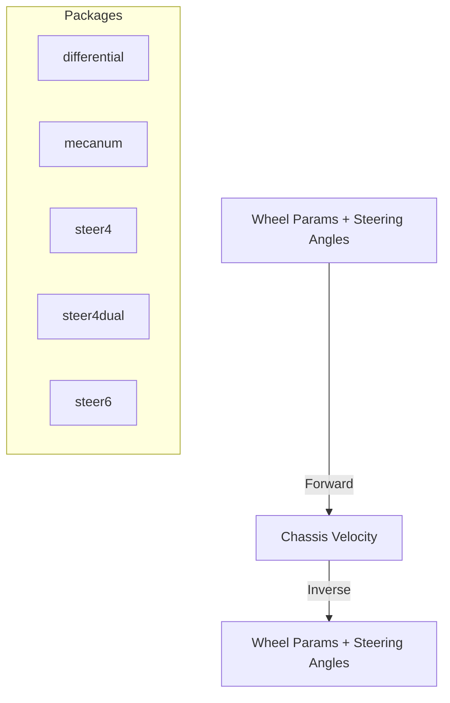

# Wheeled Kinematics Refactor & Extensions

## Goals

- Restructure existing implementations into focused subpackages while keeping public API through `kinematics.Kinematics`.
- Introduce steering-aware kinematics for 4-wheel and 6-wheel chassis with both forward and inverse solvers.
- Maintain single responsibility per package, avoid redundant constructors, and keep functions within the 30-line guideline.

## Target Package Layout

```text
pkg/core/math/control/kinematics/wheels/
├── differential/        # two-wheel differential drive
├── mecanum/             # mecanum drive with omnidirectional wheels
├── steer4/              # front-steer, rear or all-wheel drive
├── steer4dual/          # front & rear steering, selectable drive
└── steer6/              # six-wheel articulated steering (e.g., Mars rover)
```

- Each package exports a `New` constructor returning `kinematics.Kinematics`.
- Constructors accept geometry (wheel radius, axle/base distances) and steering configuration flags.
- The root package will offer thin re-exports if needed later (out of scope now).

## Shared Concepts

- `Params()` always returns wheel rotational velocities (rad/s) in wheel order.
- `Effector()` returns chassis state vector. For steering platforms we use `[vx, vy, ω]` for mecanum-like systems and `[v, ω]` for classic Ackermann-style chassis, augmented with steering angles when necessary.
- Forward kinematics: map wheel rates (and steering angles where appropriate) to chassis velocity.
- Inverse kinematics: compute wheel rates (and steering angles) from desired chassis velocity.
- Steering angles are part of the parameter vector for inverse problems; forward mode reads them from params to compute chassis velocity.

## Differential (Refactor)

- Move existing logic into `differential` package with struct `drive`.
- No behavioral changes; only adjust exports and documentation.

## Mecanum (Refactor)

- Move logic into `mecanum` package with struct `drive`.
- Keep existing matrix-based solver; ensure helper methods stay within 30 lines by extracting matrix construction where helpful.

## steer4 – Front-Steer, Rear/All Wheel Drive

- Parameters: wheel radius, wheelbase (front-to-rear distance), track width, drive mode (`rearDrive bool`, `frontDrive bool`).
- Forward:
  - Read steering angles `δ_fl` and `δ_fr` from params.
  - Compute per-wheel velocity vectors given chassis twist and steering headings.
- Inverse:
  - Given desired linear velocity `v` and yaw rate `ω`, compute steering angles satisfying Ackermann geometry for inner/outer wheels.
  - Distribute wheel angular velocities according to drive mode.
- Return vector layout:
  - Params: `[ω_fl, ω_fr, ω_rl, ω_rr, δ_fl, δ_fr]`.
  - Effector: `[v, ω, δ_fl, δ_fr]`.

## steer4dual – Dual-Axle Steering

- Parameters: wheel radius, front/rear wheelbase offsets (distance from CG), track width, drive mode toggles.
- Forward:
  - Separate steering angles `δf`, `δr` read from params.
  - Compute instantaneous center of rotation (ICR) using front/rear geometry.
- Inverse:
  - For desired `[v, ω]`, solve for steering angles ensuring Ackermann condition:
    - `tan(δf) = wheelbase_front * ω / v`
    - `tan(δr) = -wheelbase_rear * ω / v` for counter-phase steering if requested.
- Params layout: `[ω_fl, ω_fr, ω_rl, ω_rr, δ_fl, δ_fr, δ_rl, δ_rr]`.
- Effector: `[v, ω, δ_fl, δ_fr, δ_rl, δ_rr]`.

## steer6 – Six-Wheel All-Steer (Rover)

- Parameters: wheel radius, spacing between wheel pairs (front-mid, mid-rear), track width.
- Assume front and rear pairs steer with angles `δf` and `δr`; middle wheels fixed but driven.
- Forward:
  - Use front/rear steering angles from params.
  - Compute chassis velocity via weighted average of wheel contributions respecting geometry.
- Inverse:
  - From desired `[v, ω]`, solve steering angles similar to `steer4dual` but ensuring middle wheels align with curvature (zero steering).
  - Wheel angular velocities derived from local linear velocity at each axle: `v_i = v ± ω * offset`.
- Params layout: `[ω_fl, ω_fr, ω_ml, ω_mr, ω_rl, ω_rr, δ_fl, δ_fr, δ_rl, δ_rr]`.
- Effector: `[v, ω, δ_fl, δ_fr, δ_rl, δ_rr]`.

## Numerical Considerations

- Guard divisions by zero by early returns when `|ω|` or `|v|` are below thresholds.
- Clamp steering angles within mechanical limits (optional extension).
- Use helper functions for repeated geometry computations (track radius, Ackermann calculations).

## Testing Strategy

- Table-driven tests per package covering:
  - Straight-line motion (ω = 0).
  - Pure rotation (v = 0).
  - Mixed turning with positive/negative ω.
  - Round-trip consistency: Inverse -> Forward should reproduce original effector within tolerance.

## Mermaid Overview



