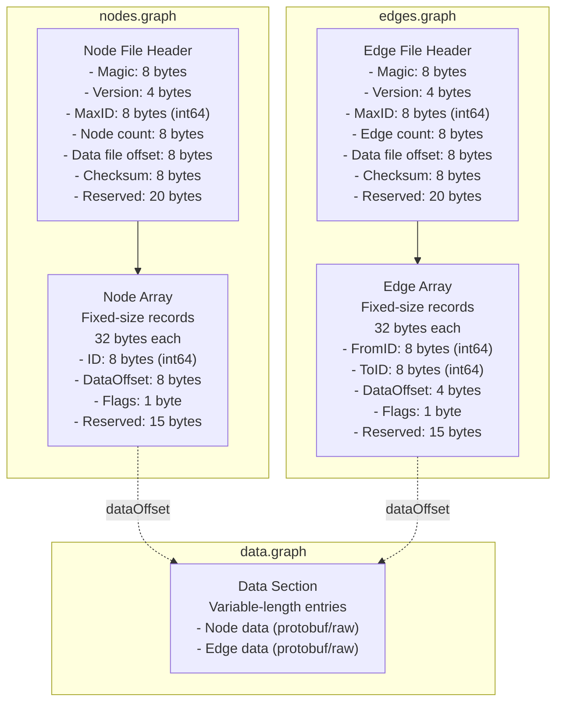
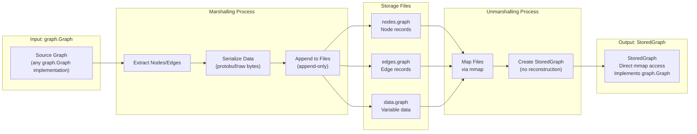
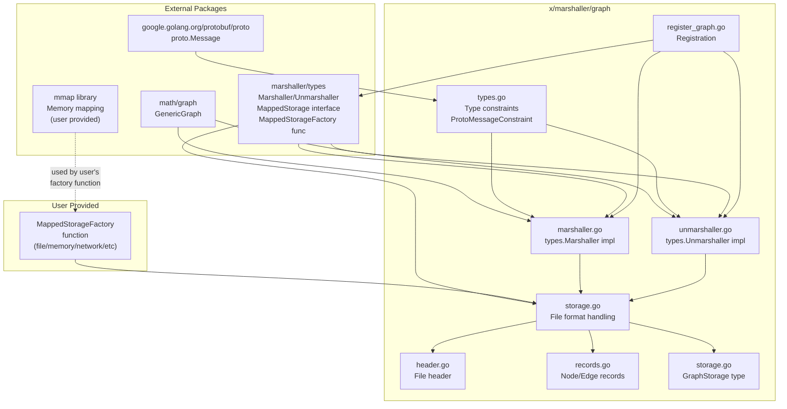

# Graph Marshaller Specification

## Overview

The graph marshaller provides efficient, persistent storage for graphs using memory-mapped files (mmap) with a Neo4j-inspired storage layout. It implements its own memory-efficient graph structure that conforms to `math/graph` interfaces, optimized for quick append operations and fast traversal.

**Key Features:**
- **Efficient Storage**: Separate files for nodes, edges, and data with fixed-size structs for cache-friendly access
- **Memory-Mapped Files**: Uses mmap for efficient I/O and support for large graphs
- **Append-Only Additions**: New nodes/edges are appended efficiently without full file rewrite
- **Flexible Data Types**: Supports `any` type for node/edge data (protobuf by default, raw bytes for primitives)
- **Optimized Traversal**: Custom graph implementation optimized for neighbor queries and tree traversal
- **Transaction Support**: GORM-style transaction wrapper with Commit/Rollback
- **Defragmentation**: Placeholder for future defragmentation to handle deleted record holes

## Architecture

### Storage Layout

The storage format uses three separate files optimized for append operations and fast traversal:

**File Structure:**
- `nodes.graph` - Node records and metadata
- `edges.graph` - Edge records and metadata  
- `data.graph` - Variable-length node/edge data (protobuf or raw bytes)



**Key Design Decisions:**
- **Separate Files**: Allows independent growth and mapping
- **32-byte Records**: Round number allows field expansion via reserved bytes
- **Append-Only**: New records appended to end, defragmentation handles holes
- **ID Generation**: Incremental (maxID tracked in headers)
- **Checksums**: For corruption detection

### Data Flow



### Data Structures

#### Fixed-Size Node Record (32 bytes)
```go
type NodeRecord struct {
    ID         int64   // Node identifier (8 bytes)
    DataOffset uint64  // Offset into data.graph file (8 bytes)
    Flags      uint8   // Status flags (deleted, etc.) (1 byte)
    Reserved   [15]byte // Reserved for future expansion (15 bytes)
}
```

#### Fixed-Size Edge Record (32 bytes)
```go
type EdgeRecord struct {
    FromID     int64   // Source node ID (8 bytes)
    ToID       int64   // Target node ID (8 bytes)
    DataOffset uint32  // Offset into data.graph file (4 bytes)
    Flags      uint8   // Status flags (deleted, etc.) (1 byte)
    Reserved   [15]byte // Reserved for future expansion (15 bytes)
}
```

**Design Decisions:**
- **No Cost Field**: Cost is algorithm-dependent and stored in edge data (protobuf/raw bytes)
- **32-byte Alignment**: Record size kept at 32 bytes for cache alignment and future expansion
- **Cost Extraction**: `StoredGraph.Cost()` reads edge data and extracts cost (algorithm-specific)
- **Interface Compliance**: Satisfies `graph.Graph` interface, but cost format is user-defined

#### Node File Header (64 bytes)
```go
type NodeFileHeader struct {
    Magic         [8]byte  // File format identifier
    Version       uint32   // Format version
    MaxID         int64   // Maximum node ID (for ID generation) (8 bytes)
    NodeCount     uint64   // Number of active nodes (8 bytes)
    DataFileOffset uint64  // Offset to data section in data.graph (8 bytes)
    Checksum      uint64   // Checksum for corruption detection (8 bytes)
    Reserved      [20]byte // Reserved for future use (20 bytes)
}
```

#### Edge File Header (64 bytes)
```go
type EdgeFileHeader struct {
    Magic         [8]byte  // File format identifier
    Version       uint32   // Format version
    MaxID         int64   // Maximum edge ID (for ID generation) (8 bytes)
    EdgeCount     uint64   // Number of active edges (8 bytes)
    DataFileOffset uint64  // Offset to data section in data.graph (8 bytes)
    Checksum      uint64   // Checksum for corruption detection (8 bytes)
    Reserved      [20]byte // Reserved for future use (20 bytes)
}
```

## API Design

### Core Interfaces

The graph marshaller implements the standard `Marshaller` and `Unmarshaller` interfaces from `marshaller/types`:

```go
// GraphMarshaller implements types.Marshaller
type GraphMarshaller struct {
    storageFactory types.MappedStorageFactory // Function that creates storage
    opts           types.Options
    cfg            config
}

// Format returns the format name.
func (m *GraphMarshaller) Format() string {
    return "graph"
}

// Marshal encodes a graph to storage.
// The writer parameter is ignored (similar to gocv marshaller).
// Storage paths are specified via WithPath, WithEdgesPath, WithLabelsPath options.
func (m *GraphMarshaller) Marshal(w io.Writer, value any, opts ...types.Option) error

// GraphUnmarshaller implements types.Unmarshaller
type GraphUnmarshaller struct {
    storageFactory types.MappedStorageFactory // Function that creates storage
    opts           types.Options
    cfg            config
}

// Format returns the format name.
func (u *GraphUnmarshaller) Format() string {
    return "graph"
}

// Unmarshal decodes a graph from storage.
// The reader parameter is ignored (similar to gocv marshaller).
// Storage paths are specified via WithPath, WithEdgesPath, WithLabelsPath options.
// By default, unmarshalled graphs are linked to disk storage (mirrored).
// Use WithMirror(false) to disable disk linking.
func (u *GraphUnmarshaller) Unmarshal(r io.Reader, dst any, opts ...types.Option) error
```

### Graph Implementation

The marshaller implements its own efficient graph structure that conforms to `math/graph` interfaces:

```go
// StoredGraph implements graph.Graph interface with memory-mapped storage.
// It does not require full reconstruction - nodes and edges are accessed directly from mmap.
type StoredGraph struct {
    nodeStorage types.MappedStorage
    edgeStorage types.MappedStorage
    dataStorage types.MappedStorage
    // Internal caches and indexes
}

// Neighbors returns neighbors of a node by reading directly from edge storage.
// No full graph reconstruction needed.
func (g *StoredGraph) Neighbors(n graph.Node) []graph.Node

// Cost returns edge cost by reading from edge data.
// Cost is algorithm-dependent and stored in edge data (not in edge record).
// Implementation reads edge data and extracts cost field (algorithm-specific).
// Returns 0 if edge doesn't exist or cost cannot be determined.
// Note: This satisfies graph.Graph interface, but cost extraction is algorithm-dependent.
func (g *StoredGraph) Cost(from, to graph.Node) float32
```

### Specialized Graph Types

The marshaller supports specialized graph types beyond generic graphs:

#### StoredTree

`StoredTree` implements `graph.Tree[any, any]` for tree structures:

```go
// StoredTree provides tree-specific helpers on top of StoredGraph.
type StoredTree struct {
    *StoredGraph
    rootID   int64
    treeType string
}

// Root returns the stored root node.
func (t *StoredTree) Root() graph.Node[any, any]

// GetHeight computes the longest path length from root to leaves.
func (t *StoredTree) GetHeight() int

// NodeCount returns the total number of nodes in the tree.
func (t *StoredTree) NodeCount() int
```

#### StoredDecisionTree

`StoredDecisionTree` implements `graph.DecisionTree[any, any, any, any]` for decision trees with registered operations:

```go
// StoredDecisionTree executes decision operations directly from storage.
type StoredDecisionTree struct {
    *StoredTree
    nodeOps map[int64]decisionNodeOpInfo
    edgeOps map[string]decisionEdgeOpInfo
}

// Decide evaluates decision tree starting at provided node (nil uses root).
func (t *StoredDecisionTree) Decide(start graph.Node[any, any], inputs ...any) ([]any, error)
```

**Operation Registration:**
- Decision node operations are registered via `WithDecisionOp(fns ...any)`
- Decision edge operations (criteria evaluators) are registered via `WithDecisionEdge(fns ...any)`
- Operations are identified by their function name via reflection (`runtime.FuncForPC`)
- During marshalling, operation names are stored in metadata
- During unmarshalling, registered operations are bound to nodes/edges by name
- If an operation name is not registered, unmarshalling fails with a descriptive error

#### StoredExpressionGraph

`StoredExpressionGraph` implements `graph.ExpressionGraph[any, any, any, any]` for expression graphs with computation operations:

```go
// StoredExpressionGraph evaluates expression graphs directly from storage.
type StoredExpressionGraph struct {
    *StoredGraph
    rootID  int64
    nodeOps map[int64]expressionOpInfo
}

// Compute evaluates expression graph for all inputs (nil start uses default root).
func (g *StoredExpressionGraph) Compute(start graph.Node[any, any], inputs ...any) ([]any, error)
```

**Operation Registration:**
- Expression operations are registered via `WithExpressionOp(fns ...any)`
- Operations are identified by their function name via reflection
- During marshalling, operation names are stored in metadata along with root node ID
- During unmarshalling, registered operations are bound to nodes by name
- If an operation name is not registered, unmarshalling fails with a descriptive error

**Graph Metadata:**
- Graph kind (generic, tree, decision_tree, expression_graph) is stored in file headers
- Additional metadata (root IDs, operation mappings) is stored in the data file
- Metadata allows proper reconstruction of specialized graph types during unmarshalling

### Graph Modification API

The marshaller provides methods for modifying graphs directly in storage:

```go
// GraphStorage provides access to a graph stored in mmap-backed storage.
type GraphStorage struct {
    nodeStorage types.MappedStorage
    edgeStorage types.MappedStorage
    dataStorage types.MappedStorage
    graph       *StoredGraph  // Efficient graph implementation
}

// BeginTransaction starts a new transaction and returns a transaction wrapper.
// Similar to GORM pattern - operations on the wrapper are transactional.
func (s *GraphStorage) BeginTransaction() (*GraphTransaction, error)

// GraphTransaction wraps graph operations in a transaction.
type GraphTransaction struct {
    storage *GraphStorage
    changes []change
}

// AddNode adds a node to the graph storage.
// Changes are recorded but not committed until Commit().
func (tx *GraphTransaction) AddNode(data any) (int64, error) // Returns node ID

// AddEdge adds one or more edges to the graph storage.
// Cost (if needed) should be included in the edge data.
func (tx *GraphTransaction) AddEdge(fromID, toID int64, data any, edges ...EdgeSpec) error

// DeleteNode marks a node as deleted (defragmentation handles cleanup).
func (tx *GraphTransaction) DeleteNode(nodeID int64) error

// DeleteEdge marks one or more edges as deleted.
func (tx *GraphTransaction) DeleteEdge(fromID, toID int64, edges ...EdgeSpec) error

// UpdateNode updates a node's data in storage.
// Update strategy:
//   - If new data size differs from old: append new record to data.graph, update offset in node record
//   - If new data size is same or smaller: update in place at existing offset
//   - Old data location becomes a hole (defragmentation handles cleanup)
func (tx *GraphTransaction) UpdateNode(nodeID int64, data any) error

// UpdateEdge updates an edge's data in storage.
// Cost (if needed) should be included in the edge data.
// Update strategy:
//   - If new data size differs from old: append new record to data.graph, update offset in edge record
//   - If new data size is same or smaller: update in place at existing offset
//   - Old data location becomes a hole (defragmentation handles cleanup)
func (tx *GraphTransaction) UpdateEdge(fromID, toID int64, data any) error

// Commit commits all changes atomically to storage.
// Uses atomic write patterns to prevent broken state on power loss.
func (tx *GraphTransaction) Commit() error

// Rollback discards all changes in the transaction.
func (tx *GraphTransaction) Rollback() error

// EdgeSpec specifies an edge for batch operations.
type EdgeSpec struct {
    FromID int64
    ToID   int64
    Data   any  // Edge data (cost included if needed)
}
```

**Key Design Decisions:**
- **GORM-style Transactions**: `BeginTransaction()` returns wrapper with `Commit()`/`Rollback()`
- **Atomic Writes**: Prevents broken partial state on power loss (Neo4j-style)
- **Append-Only**: New records appended, deleted records marked with flags
- **Flexible Data Types**: Supports `any` type (protobuf by default, raw bytes for primitives)

### Storage Factory Helpers

The graph marshaller package provides helper functions for common storage implementations:

```go
// NewFileMap creates a file-based MappedStorage using mmap.
// This is a convenience function that returns a MappedStorageFactory function
// for file-based storage. The returned function can be used with WithMappedStorageFactory.
func NewFileMap() types.MappedStorageFactory

// NewMemoryMap creates a memory-based MappedStorage.
// This is a convenience function that returns a MappedStorageFactory function
// for in-memory storage. Useful for testing or temporary storage.
// The returned function can be used with WithMappedStorageFactory.
func NewMemoryMap() types.MappedStorageFactory

// NewTarMap returns a TarFactory that exposes entries inside a tar or tar.gz
// archive as MappedStorage. Callers pass the archive filename once, obtain the
// inner MappedStorageFactory via Factory(), and can call Commit() after making
// writable changes to rebuild the archive.
func NewTarMap(archivePath string) *storage.TarFactory
```

### Options

Graph marshaller options (similar to gocv marshaller pattern):

```go
// WithPath sets the main graph storage file path.
// This is the primary storage file containing nodes and edges.
func WithPath(path string) types.Option

// WithEdgesPath sets a separate file path for edge data storage.
// If not set, edges are stored in the main file.
func WithEdgesPath(path string) types.Option

// WithLabelsPath sets a separate file path for node/edge label (user data) storage.
// If not set, labels are stored in the main file's protobuf section.
func WithLabelsPath(path string) types.Option

// WithMirror controls whether unmarshalled graphs are linked to disk storage.
// Default is true (graphs are mirrored to disk).
// When false, the graph is loaded into memory and not linked to storage.
func WithMirror(mirror bool) types.Option

// WithEqual registers a custom equality callback used by StoredGraph nodes.
func WithEqual(fn func(a, b graph.Node[any, any]) bool) types.Option

// WithCompare registers a custom comparison callback used by StoredGraph nodes.
func WithCompare(fn func(a, b graph.Node[any, any]) int) types.Option

// WithCost registers a custom cost callback used by StoredGraph and StoredEdge.
func WithCost(fn func(from, to graph.Node[any, any]) float32) types.Option

// WithType registers proto.Message types that may appear in node or edge data.
// Can be provided multiple times to register multiple message types.
func WithType(example proto.Message) types.Option

// WithDecisionOp registers one or more decision node operations by reflection-derived name.
// Each function must have signature `func(Input) (Output, bool)`.
// Operations are identified by their function name via reflection.
func WithDecisionOp(fns ...any) types.Option

// WithDecisionEdge registers one or more decision edge operations (criteria evaluators).
// Each function must have signature `func(Input) bool`.
// Operations are identified by their function name via reflection.
func WithDecisionEdge(fns ...any) types.Option

// WithExpressionOp registers one or more expression node operations.
// Each function must have signature `func(Input, map[int64]Output) (Output, bool)`.
// Operations are identified by their function name via reflection.
func WithExpressionOp(fns ...any) types.Option
```

### Storage Architecture

**Marshalled Graph (Unlinked)**:
- When `Marshal()` is called, the graph is written to storage
- The original `GenericGraph` object remains **unlinked** from storage
- Modifications to the original graph do not affect storage
- Storage is independent and can be accessed via `GraphStorage` API

**Unmarshalled Graph (Linked by Default)**:
- When `Unmarshal()` is called with `WithMirror(true)` (default):
  - Graph is loaded into memory as `GenericGraph`
  - Graph is **linked** to disk storage via `GraphStorage`
  - Modifications through `GraphStorage` API affect both memory and disk
  - The `GenericGraph` object reflects changes made through storage API
- When `Unmarshal()` is called with `WithMirror(false)`:
  - Graph is loaded into memory as `GenericGraph`
  - Graph is **not linked** to disk storage
  - Modifications only affect the in-memory graph
  - Storage remains unchanged

### Data Type Support

The marshaller supports flexible data types for nodes and edges:

```go
// NodeData represents data stored with a node.
// Can be proto.Message, raw bytes, or any serializable type.
type NodeData interface {
    // Marshal serializes the data to bytes
    Marshal() ([]byte, error)
    // Unmarshal deserializes bytes to the data
    Unmarshal([]byte) error
}

// Default implementation uses protobuf, but custom marshallers can be registered
// for efficient storage of primitive types (matrices, BoW vectors, etc.)
```

**Design Decisions:**
- **Flexible Types**: Support `any` type, not just `proto.Message`
- **Default Protobuf**: Protobuf used by default for complex types
- **Raw Bytes**: Primitive types (matrices, vectors) can use raw byte storage
- **Custom Marshallers**: Can register custom serializers per type for efficiency

## Implementation Details

### Memory Mapping Abstraction

The graph marshaller uses segregated storage interfaces following Interface Segregation Principle:

```go
// MappedStorage provides core memory-mapped access
type MappedStorage interface {
    Map(offset, length int64) (MappedRegion, error)
    Size() (int64, error)
    Close() error
}

// WritableStorage extends MappedStorage with write capabilities
type WritableStorage interface {
    MappedStorage
    Grow(size int64) error
    Sync() error
}

// ReadOnlyStorage is a marker interface for read-only storage
type ReadOnlyStorage interface {
    MappedStorage
    // No write methods
}
```

**Design Decisions:**
- **Interface Segregation**: Split into `MappedStorage`, `WritableStorage`, `ReadOnlyStorage`
- **Capability Queries**: Can check if storage supports writes
- **Flash Support**: Deferred to future (read-only flash mapping)
- **Storage Factory**: Users provide function that returns appropriate interface

### Standard Marshaller/Unmarshaller Conformance

The graph marshaller conforms to the standard interfaces but follows the gocv pattern:

1. **Marshal (io.Writer ignored)**:
   - The `io.Writer` parameter is ignored (similar to gocv marshaller)
   - Storage paths are specified via `WithPath`, `WithEdgesPath`, `WithLabelsPath` options
   - Graph is written to three separate files: `nodes.graph`, `edges.graph`, `data.graph`
   - Uses append-only writes for efficiency
   - Only new/changed data is written (mmap allows selective updates)

2. **Unmarshal (io.Reader ignored)**:
   - The `io.Reader` parameter is ignored (similar to gocv marshaller)
   - Storage paths are specified via `WithPath`, `WithEdgesPath`, `WithLabelsPath` options
   - Graph is loaded from mmap-backed storage files
   - **No full reconstruction**: `StoredGraph` accesses data directly from mmap
   - By default (`WithMirror(true)`), graph is **linked** to storage
   - With `WithMirror(false)`, graph is read-only (no linking)

3. **Graph Modification**:
   - Use `GraphStorage.BeginTransaction()` to get transaction wrapper
   - Operations on wrapper are transactional
   - `Commit()` writes atomically, `Rollback()` discards changes
   - Atomic write patterns prevent broken state on power loss

### Node/Edge Data Storage

1. **Marshalling Process:**
   - Iterate through source graph nodes and edges
   - Extract node/edge data (supports `any` type)
   - Serialize data (protobuf by default, raw bytes for primitives)
   - Append to `data.graph` file (append-only)
   - Store offset and ID in node/edge record
   - Update maxID in header for ID generation

2. **Unmarshalling Process:**
   - Map node, edge, and data files into memory
   - Create `StoredGraph` that reads directly from mmap
   - **No full reconstruction**: Nodes/edges accessed on-demand
   - Lazy deserialization: Data unmarshalled only when accessed
   - Efficient neighbor queries via direct edge array access

3. **ID Generation:**
   - Incremental IDs: `maxID + 1` for new nodes/edges
   - MaxID tracked in file headers
   - Thread-safe ID generation (if needed)

4. **Data Update Strategy:**
   - **Size Check**: Compare new serialized data size with existing data size
   - **In-Place Update**: If new size ≤ old size, update data at existing offset
     - More efficient (no new allocation)
     - Preserves data locality
   - **Append Update**: If new size > old size, append new record to `data.graph`
     - Update offset in node/edge record to point to new location
     - Old data location becomes a hole
   - **Hole Management**: Defragmenter finds and compacts data holes
     - Tracks holes in data section
     - Compacts during defragmentation pass
     - Updates all affected offsets

### Graph Loading and Linking

When unmarshalling, a `StoredGraph` is created that reads directly from mmap:

```go
func (u *GraphUnmarshaller) Unmarshal(r io.Reader, dst any, opts ...types.Option) error {
    // Apply options (writer/reader ignored, paths come from options)
    localOpts, localCfg := applyOptions(u.opts, u.cfg, opts)
    
    // Check if dst is *StoredGraph or implements graph.Graph
    // Accepts both StoredGraph and graph.Graph interface
    var targetGraph graph.Graph
    
    switch v := dst.(type) {
    case *StoredGraph:
        targetGraph = v
    case graph.Graph:
        targetGraph = v
    default:
        return types.NewError("unmarshal", "graph", "dst must implement graph.Graph", nil)
    }
    
    // Load graph from storage paths specified in config
    storage, err := u.loadFromStorage(localCfg)
    if err != nil {
        return err
    }
    
    // Create StoredGraph that reads directly from mmap
    storedGraph := &StoredGraph{
        nodeStorage: storage.nodeStorage,
        edgeStorage: storage.edgeStorage,
        dataStorage: storage.dataStorage,
    }
    
    // Link to storage if mirroring is enabled
    if localCfg.mirror {
        storage.linkGraph(storedGraph)
    }
    
    // Assign to destination
    if sg, ok := dst.(*StoredGraph); ok {
        *sg = *storedGraph
    }
    
    return nil
}
```

**Key Design Decisions:**
- **No Full Reconstruction**: `StoredGraph` accesses data directly from mmap
- **Lazy Loading**: Data deserialized only when accessed
- **Efficient Traversal**: Neighbor queries use direct edge array access
- **Interface Conformance**: Implements `graph.Graph` interface

### Transaction Management

Transactions use GORM-style pattern with atomic writes:

```go
func (s *GraphStorage) BeginTransaction() (*GraphTransaction, error) {
    return &GraphTransaction{
        storage: s,
        changes: make([]change, 0),
    }, nil
}

func (tx *GraphTransaction) Commit() error {
    // Apply all changes atomically using atomic write patterns
    // Similar to Neo4j: ensure no broken partial state on power loss
    
    // 1. Write changes to temporary locations
    // 2. Update checksums
    // 3. Atomically update headers (single write operation)
    // 4. Sync to disk
    
    for _, change := range tx.changes {
        if err := tx.applyChange(change); err != nil {
            return err
        }
    }
    
    // Atomic header update (prevents broken state)
    if err := tx.writeHeadersAtomically(); err != nil {
        return err
    }
    
    // Sync to disk
    if writable, ok := tx.storage.nodeStorage.(WritableStorage); ok {
        if err := writable.Sync(); err != nil {
            return err
        }
    }
    
    // Clear transaction
    tx.changes = nil
    return nil
}

func (tx *GraphTransaction) Rollback() error {
    // Discard all changes
    tx.changes = nil
    return nil
}
```

**Key Design Decisions:**
- **GORM Pattern**: `BeginTransaction()` returns wrapper with `Commit()`/`Rollback()`
- **Atomic Writes**: Header updates are atomic (single write operation)
- **Neo4j-style Safety**: No broken partial state on power loss
- **Append-Only**: New records appended, deleted records marked with flags

### Concurrency and Thread Safety

- **Read Operations**: Multiple concurrent readers supported via mmap
- **Write Operations**: Use file locking or sync primitives for writes
- **Transaction Isolation**: Each transaction is independent
- **Defragmentation**: Placeholder for future defragmentation
  - Handles deleted record holes (from node/edge deletions)
  - Handles data holes (from appended data updates)
- **Future WAL**: Architecture supports future Write-Ahead Log for durability

## File Format Specification

### Magic Numbers
```
Node file:  0x4E4F444547524150  // "NODEGRAP" in ASCII
Edge file:  0x4544474547524150  // "EDGEGRAP" in ASCII
Data file:  0x4441544147524150  // "DATAGRAP" in ASCII
```

### Version History
- Version 1: Initial format with separate files, append-only additions, checksums

### Byte Order
- All multi-byte integers use little-endian encoding
- Float32 values use IEEE 754 format
- int64 used for IDs (signed for future negative ID support if needed)

### Checksums
- Each file header contains a checksum (CRC64 or similar)
- Checksums updated atomically with headers
- Corruption detection on load

### Data File Layout

The `data.graph` file stores variable-length node and edge data:

```
┌─────────────────────────────────────────┐
│ Node Data Entries (append-only)         │
│ ┌─────────┬──────────┬────────────────┐ │
│ │ Length  │ Type     │ Data           │ │
│ │ (4 bytes)│ (1 byte) │ (variable)     │ │
│ └─────────┴──────────┴────────────────┘ │
│ Type: 0=protobuf, 1=raw bytes, 2=custom │
│ ... (repeated for each node)            │
├─────────────────────────────────────────┤
│ Edge Data Entries (append-only)         │
│ ┌─────────┬──────────┬────────────────┐ │
│ │ Length  │ Type     │ Data           │ │
│ │ (4 bytes)│ (1 byte) │ (variable)     │ │
│ └─────────┴──────────┴────────────────┘ │
│ ... (repeated for each edge)            │
└─────────────────────────────────────────┘
```

**Design Decisions:**
- **Append-Only for New Data**: New data appended to end
- **In-Place Updates**: Data updates use in-place write when size allows
- **Append Updates**: Data updates append new record when size increases
- **Data Holes**: Updates that append create holes in data section
- **Type Field**: Supports protobuf, raw bytes, or custom marshallers
- **Defragmentation**: Finds and compacts data holes (from appended updates)
- **Efficient Access**: Direct offset access via node/edge records

## Transaction Logs (Future)

The architecture supports future transaction log implementation:

### Design Considerations
- Append-only log file separate from main graph file
- Each transaction record contains:
  - Operation type (INSERT_NODE, DELETE_NODE, UPDATE_EDGE, etc.)
  - Timestamp
  - Operation data (protobuf-encoded)
- Support for checkpointing (merging log into main file)
- Support for rollback to previous checkpoints

### Reserved Space
- File header contains reserved bytes for future transaction log metadata
- Can add transaction log offset and checkpoint information

## Error Handling

- **File I/O Errors**: Wrapped with context about operation
- **Format Errors**: Invalid magic numbers, version mismatches
- **Checksum Errors**: Corruption detected via header checksums
- **Serialization Errors**: Data that cannot be serialized (protobuf/raw bytes)
- **Size Errors**: Graph too large for available memory/disk
- **Corruption Errors**: Invalid offsets, out-of-bounds access
- **Atomic Write Failures**: Rollback on partial write failure
- **Power Loss**: Atomic write patterns prevent broken state (Neo4j-style)
- **Transaction Errors**: Commit failures trigger automatic rollback

## Performance Considerations

### Optimizations
1. **Cache Locality**: Fixed-size 32-byte records enable better CPU cache utilization
2. **Sequential Access**: Node and edge arrays stored contiguously
3. **Zero-Copy**: mmap allows direct memory access without copying
4. **Append-Only Additions**: New records appended efficiently (O(1))
5. **No Full Reconstruction**: `StoredGraph` accesses data directly from mmap
6. **Lazy Deserialization**: Data unmarshalled only when accessed
7. **Fast Traversal**: Neighbor queries use direct edge array access
8. **Selective Writes**: Only new/changed data written (mmap allows this)

### Limitations
1. **File Size**: Limited by available virtual memory and file system
2. **Concurrent Writes**: Requires coordination (file locking)
3. **Defragmentation**: Deleted records create holes (defragmentation handles this)
4. **Query Optimization**: No secondary indexes yet (future enhancement)

### Performance Goals
- **Quick Append**: O(1) addition of nodes/edges
- **Quick Traversal**: Fast neighbor queries and tree traversal
- **Efficient Unmarshalling**: No full reconstruction, direct mmap access
- **Custom Algorithms**: Support custom traversal/search functions via graph interface

## Usage Examples

### Basic Marshalling (Standard Interface)

```go
import (
    "github.com/itohio/EasyRobot/x/math/graph"
    "github.com/itohio/EasyRobot/x/marshaller"
    graphmarshaller "github.com/itohio/EasyRobot/x/marshaller/graph"
    "github.com/itohio/EasyRobot/x/marshaller/types"
)

// Create marshaller directly with file-based storage
factory := graphmarshaller.NewFileMap()
mar, err := graphmarshaller.NewMarshaller(factory,
    graphmarshaller.WithPath("graph.dat"),
    graphmarshaller.WithEdgesPath("edges.dat"),      // Optional
    graphmarshaller.WithLabelsPath("labels.dat"),     // Optional
)

// Create graph
g := graph.NewGenericGraph()
// ... add nodes and edges ...

// Marshal to storage (writer parameter is ignored)
var buf bytes.Buffer // Writer is ignored, but required by interface
err = mar.Marshal(&buf, g)
// Graph is now stored in "graph.dat" (and optionally edges.dat, labels.dat)
// Original graph 'g' remains unlinked from storage
```

### Basic Unmarshalling (Standard Interface)

```go
// Create unmarshaller with file-based storage
unmar, err := graphmarshaller.NewUnmarshaller(factory,
    graphmarshaller.WithPath("graph.dat"),
    graphmarshaller.WithEdgesPath("edges.dat"),       // Optional
    graphmarshaller.WithLabelsPath("labels.dat"),      // Optional
    graphmarshaller.WithMirror(true),                  // Default: link to storage
    types.WithMappedStorageFactory(graphmarshaller.NewFileMap()), // Use provided file-based storage
)

// Or use memory-based storage for testing
unmar, err = marshaller.NewUnmarshaller("graph",
    graphmarshaller.WithPath("graph.dat"),
    graphmarshaller.WithMirror(false),                 // Don't link to storage
    types.WithMappedStorageFactory(graphmarshaller.NewMemoryMap()), // Use provided memory-based storage
)

// Unmarshal from storage (reader parameter is ignored)
var buf bytes.Buffer // Reader is ignored, but required by interface
var g graph.StoredGraph
err = unmar.Unmarshal(&buf, &g)
// StoredGraph is created and linked to storage by default
// No full reconstruction - data accessed directly from mmap
// Modifications through GraphStorage API will affect both memory and disk
```

### Custom Storage Implementation

Users can provide their own storage factory function for custom implementations:

```go
// Custom network storage factory
networkStorageFactory := func(path string, readOnly bool) (types.MappedStorage, error) {
    // User's custom implementation for network-based storage
    return createNetworkMappedStorage(path, readOnly)
}

// Use custom storage
mar, err := graphmarshaller.NewMarshaller(factory,
    graphmarshaller.WithPath("graph.dat"),
    types.WithMappedStorageFactory(networkStorageFactory), // Use custom storage
)
```

### Unmarshalling Without Linking

```go
// Unmarshal without linking to storage
unmar, err := graphmarshaller.NewUnmarshaller(factory,
    graphmarshaller.WithPath("graph.dat"),
    graphmarshaller.WithMirror(false), // Don't link to storage
)

var g graph.StoredGraph
err = unmar.Unmarshal(nil, &g)
// StoredGraph is created but not linked to storage
// Read-only access - modifications don't affect storage
```

### Graph Modification with Transactions

```go
import (
    "github.com/itohio/EasyRobot/x/marshaller/graph"
)

// Get GraphStorage from unmarshalled graph (when linked)
storage := graph.GetStorage(&g)

// Begin transaction (GORM-style - returns wrapper)
tx, err := storage.BeginTransaction()
if err != nil {
    return err
}
defer tx.Rollback() // Rollback on error

// Add nodes (returns node ID)
nodeID1, err := tx.AddNode(&MyNodeData{...})
nodeID2, err := tx.AddNode(&MyNodeData{...})

// Add edges (varargs)
// Cost should be included in edge data if needed
err = tx.AddEdge(nodeID1, nodeID2, &MyEdgeData{Cost: 1.5, ...})
err = tx.AddEdge(nodeID1, nodeID3, &MyEdgeData{Cost: 2.0, ...},
    graph.EdgeSpec{FromID: nodeID2, ToID: nodeID3, Data: &MyEdgeData{Cost: 1.0, ...}},
    graph.EdgeSpec{FromID: nodeID3, ToID: nodeID4, Data: &MyEdgeData{Cost: 0.5, ...}},
)

// Update node/edge data
err = tx.UpdateNode(nodeID1, &MyNodeData{...})
err = tx.UpdateEdge(nodeID1, nodeID2, &MyEdgeData{Cost: 1.8, ...})

// Delete operations
err = tx.DeleteEdge(nodeID1, nodeID2)
err = tx.DeleteNode(nodeID3)

// Commit transaction (writes atomically to mmap storage)
err = tx.Commit()
// All changes are now written to storage and reflected in linked graph
```

### Decision Tree Marshalling

```go
import (
    graphlib "github.com/itohio/EasyRobot/x/math/graph"
    graphmarshaller "github.com/itohio/EasyRobot/x/marshaller/graph"
)

// Define decision operations
func decisionLeafLow(input int) (string, bool) {
    if input < 5 {
        return "low", true
    }
    return "", false
}

func decisionLeafHigh(input int) (string, bool) {
    if input >= 5 {
        return "high", true
    }
    return "", false
}

func decisionEdgeLessThanFive(input int) bool { return input < 5 }
func decisionEdgeGreaterEqFive(input int) bool { return input >= 5 }

// Create decision tree
tree := graphlib.NewGenericDecisionTree[string, float32, int, string]("root")
rootIdx := tree.RootIdx()
leftIdx := tree.AddChild(rootIdx, "left")
rightIdx := tree.AddChild(rootIdx, "right")

tree.SetEdgeOpByIndex(rootIdx, leftIdx, decisionEdgeLessThanFive)
tree.SetEdgeOpByIndex(rootIdx, rightIdx, decisionEdgeGreaterEqFive)
tree.SetNodeOpByIndex(leftIdx, decisionLeafLow)
tree.SetNodeOpByIndex(rightIdx, decisionLeafHigh)

// Marshal with operation registration (variadic - can register multiple ops)
factory := graphmarshaller.NewFileMap()
mar, err := graphmarshaller.NewMarshaller(factory,
    graphmarshaller.WithPath("decision.nodes"),
    graphmarshaller.WithEdgesPath("decision.edges"),
    graphmarshaller.WithLabelsPath("decision.data"),
    graphmarshaller.WithDecisionOp(decisionLeafLow, decisionLeafHigh),
    graphmarshaller.WithDecisionEdge(decisionEdgeLessThanFive, decisionEdgeGreaterEqFive),
)
if err != nil {
    return err
}
err = mar.Marshal(nil, tree)

// Unmarshal with same operation registration
unmar, err := graphmarshaller.NewUnmarshaller(factory,
    graphmarshaller.WithPath("decision.nodes"),
    graphmarshaller.WithEdgesPath("decision.edges"),
    graphmarshaller.WithLabelsPath("decision.data"),
    graphmarshaller.WithDecisionOp(decisionLeafLow, decisionLeafHigh),
    graphmarshaller.WithDecisionEdge(decisionEdgeLessThanFive, decisionEdgeGreaterEqFive),
)
if err != nil {
    return err
}

var storedTree graphmarshaller.StoredDecisionTree
err = unmar.Unmarshal(nil, &storedTree)
if err != nil {
    return err
}
defer storedTree.Close()

// Use the stored decision tree
results, err := storedTree.Decide(nil, 2, 7, 4, 9)
// Results: ["low", "high", "low", "high"]
```

### Expression Graph Marshalling

```go
import (
    graphlib "github.com/itohio/EasyRobot/x/math/graph"
    graphmarshaller "github.com/itohio/EasyRobot/x/marshaller/graph"
)

// Define expression operations
func exprInput(input float64, _ map[int64]float64) (float64, bool) {
    return input, true
}

func exprDouble(input float64, _ map[int64]float64) (float64, bool) {
    return input * 2, true
}

func exprSum(_ float64, childOutputs map[int64]float64) (float64, bool) {
    var total float64
    for _, v := range childOutputs {
        total += v
    }
    return total, true
}

// Create expression graph
expr := graphlib.NewGenericExpressionGraph[string, float32, float64, float64]()
inputNode, _ := expr.AddNode("input", exprInput)
doubleNode, _ := expr.AddNode("double", exprDouble)
sumNode, _ := expr.AddNode("sum", exprSum)
expr.AddEdge(sumNode, inputNode, 0)
expr.AddEdge(sumNode, doubleNode, 0)
expr.SetRoot(sumNode)

// Marshal with operation registration (variadic - can register multiple ops)
factory := graphmarshaller.NewFileMap()
mar, err := graphmarshaller.NewMarshaller(factory,
    graphmarshaller.WithPath("expr.nodes"),
    graphmarshaller.WithEdgesPath("expr.edges"),
    graphmarshaller.WithLabelsPath("expr.data"),
    graphmarshaller.WithExpressionOp(exprInput, exprDouble, exprSum),
)
if err != nil {
    return err
}
err = mar.Marshal(nil, expr)

// Unmarshal with same operation registration
unmar, err := graphmarshaller.NewUnmarshaller(factory,
    graphmarshaller.WithPath("expr.nodes"),
    graphmarshaller.WithEdgesPath("expr.edges"),
    graphmarshaller.WithLabelsPath("expr.data"),
    graphmarshaller.WithExpressionOp(exprInput, exprDouble, exprSum),
)
if err != nil {
    return err
}

var storedExpr graphmarshaller.StoredExpressionGraph
err = unmar.Unmarshal(nil, &storedExpr)
if err != nil {
    return err
}
defer storedExpr.Close()

// Use the stored expression graph
results, err := storedExpr.Compute(nil, 1.0, 2.5, -3.0)
// Results computed based on expression graph evaluation
```

## Testing Strategy

1. **Unit Tests**:
   - File format encoding/decoding
   - Node/edge record serialization
   - Protobuf data marshalling/unmarshalling

2. **Integration Tests**:
   - Round-trip marshalling (graph → file → graph)
   - Large graph handling
   - Concurrent read access

3. **Performance Tests**:
   - Benchmark marshalling/unmarshalling
   - Compare with in-memory graph operations
   - Measure mmap overhead

4. **Corruption Tests**:
   - Invalid magic numbers
   - Version mismatches
   - Corrupted offsets
   - Out-of-bounds access

## Dependencies

- `github.com/itohio/EasyRobot/x/math/graph` - Graph interfaces and GenericGraph
- `github.com/itohio/EasyRobot/x/marshaller/types` - Marshaller interfaces and mmap abstraction
- `google.golang.org/protobuf/proto` - Protobuf marshalling
- Standard library `syscall` (platform-specific) - Memory mapping implementation
- Standard library: `io`, `os`, `encoding/binary`, `sync`

## Defragmentation

Defragmentation handles two types of holes in storage:

### 1. Record Holes (Node/Edge Arrays)
- **Source**: Deleted nodes/edges marked with flags
- **Location**: `nodes.graph` and `edges.graph` files
- **Impact**: Wasted space in fixed-size record arrays
- **Solution**: Compact records, remove deleted entries, update counts

### 2. Data Holes (Data Section)
- **Source**: Data updates that appended new records (when size increased)
- **Location**: `data.graph` file
- **Impact**: Fragmented data section with unused space
- **Hole Identification**:
  - Defragmenter scans all node/edge records to find active data offsets
  - Builds map of used regions in data section
  - Identifies gaps (holes) between used regions
  - Holes are regions not referenced by any active node/edge record
- **Solution**: 
  - Scan data section to find holes (gaps between used regions)
  - Compact data by moving records forward to fill holes
  - Update all node/edge record offsets to point to new locations
  - Maintain data order (node data, then edge data)
  - Truncate file to remove trailing unused space

### Defragmentation Process

```go
// Defragment compacts storage by removing holes
func (s *GraphStorage) Defragment() error {
    // 1. Compact node/edge record arrays
    //    - Remove deleted records (marked with flags)
    //    - Shift remaining records forward
    //    - Update counts in headers
    
    // 2. Find data holes in data.graph
    //    - Scan data section for unused regions
    //    - Build map of holes (offset, size)
    
    // 3. Compact data section
    //    - Move data records forward to fill holes
    //    - Update offsets in all node/edge records
    //    - Maintain data order (node data, then edge data)
    
    // 4. Update headers
    //    - Update checksums
    //    - Atomically write headers
    
    // 5. Truncate files
    //    - Remove trailing unused space
    //    - Sync to disk
}
```

**Design Decisions:**
- **Placeholder Implementation**: Basic structure in place, full implementation deferred
- **Hole Tracking**: Defragmenter scans and identifies all holes
- **Atomic Operation**: Defragmentation is atomic (all-or-nothing)
- **Offset Updates**: All affected offsets updated during compaction
- **Performance**: Can be run periodically or on-demand

## Future Enhancements

1. **Defragmentation**: Full implementation of hole compaction (placeholder exists)
2. **WAL (Write-Ahead Log)**: For durability and recovery (distant future)
3. **Indexing**: Secondary indexes for fast node/edge lookup (spatial, property-based)
4. **Flash Support**: Read-only flash memory mapping (deferred)
5. **Query Optimization**: Support custom traversal/search functions via graph interface
6. **Format Migration**: Utilities to migrate between format versions

**Explicitly NOT Planned:**
- Query language (will write specific algorithms per use case)
- Compression (optimize for speed, not size)
- Neo4j integration (but design doesn't prevent it)

## Package Structure

```
x/marshaller/graph/
├── SPEC.md                      # This document
├── DESIGN_DECISION_EXPRESSION.md # Design for decision/expression support
├── SOLID_PLAN.md                # SOLID refactor plan and execution
├── marshaller.go                # Marshaller implementation (types.Marshaller)
├── unmarshaller.go              # Unmarshaller implementation (types.Unmarshaller)
├── graph.go                     # StoredGraph struct definition and callbacks
├── stored_graph.go              # StoredGraph core implementation
├── stored_node.go               # storedNode implementation (SOLID refactor)
├── stored_edge.go               # storedEdge implementation (SOLID refactor)
├── stored_tree.go               # StoredTree implementation
├── stored_decision_tree.go      # StoredDecisionTree implementation
├── stored_expression_graph.go   # StoredExpressionGraph implementation
├── graph_capture.go             # Graph structure capture via reflection
├── graph_metadata.go             # Graph metadata (kind, operations, root IDs)
├── ops_registry.go              # Operation registry and invocation helpers
├── edge_keys.go                 # Edge key utilities
├── options.go                   # Options (WithPath, WithDecisionOp, etc.)
├── format.go                    # File format definitions and encoding
├── writer.go                    # File writing implementation
├── reader.go                    # File reading implementation
├── data.go                      # Data serialization/deserialization
├── data_read.go                 # Data reading helpers
├── storage.go                   # Storage factory helpers
└── marshaller_e2e_test.go       # End-to-end tests
    decision_expression_e2e_test.go # Decision/expression e2e tests
```

**Subpackages (following SOLID principles):**
- `storage/` - Storage abstraction and implementations
- `transaction/` - Transaction management
- `graph/` - Graph implementation and traversal

### Component Relationships



## Registration

The graph marshaller registers itself with the main marshaller system:

```go
//go:build !no_graph
// +build !no_graph


## Notes

- **Optimization Goals**: Quick append, quick traversal, efficient unmarshalling
- **Append-Only**: New records appended efficiently, defragmentation handles holes
- **No Full Reconstruction**: `StoredGraph` accesses data directly from mmap
- **Flexible Types**: Supports `any` type (protobuf default, raw bytes for primitives)
- **GORM-style Transactions**: `BeginTransaction()` returns wrapper with `Commit()`/`Rollback()`
- **Atomic Writes**: Prevents broken state on power loss (Neo4j-style)
- **Separate Files**: Three files (`nodes.graph`, `edges.graph`, `data.graph`) for independent growth
- **32-byte Records**: Round number allows field expansion via reserved bytes
- **Checksums**: Corruption detection in file headers
- **ID Generation**: Incremental (maxID tracked in headers)
- **Interface Segregation**: Split storage interfaces following SOLID principles
- **SOLID Refactor**: Runtime implementation split into focused files (`stored_graph.go`, `stored_node.go`, `stored_edge.go`) with helper methods to avoid exposing internal structures
- **Specialized Graph Types**: Support for trees, decision trees, and expression graphs with operation registration via reflection
- **Variadic Options**: `WithDecisionOp`, `WithDecisionEdge`, and `WithExpressionOp` accept multiple operations in a single call

